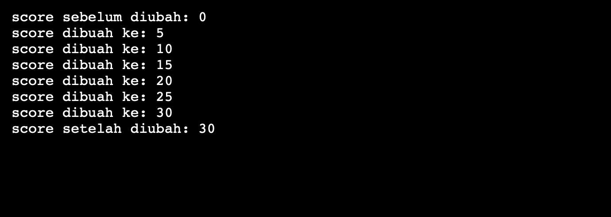

## Memori

Setiap variabel yang kita buat pada program akan memiliki alamat memori. Alamat memori berfungsi untuk menentukan lokasi penyimpanan data pada memori (RAM). Kadang alamat memori ini disebut reference atau referensi. \
perhatikan gambar berikut:

Pada gambar ini, kita membuat dua variabel, yaitu `score` dan `hp`. Kedua variabel ini punya alamat memori masing-masing. Variabel score alamat memorinya adalah `01abc`, sedangkan hp alamat memorinya `02ffd`. Selama sebuah alamat masih kosong maka, alamat itu yang akan dipilih. Pemilihan alamat memori dilakukan secara acak. Inilah mengapa memori ini di sebut RAM (Random Access Memory).

Intinya, setiap kita membuat variabel pasti akan punya alamat memori untuk menampilkan atau mengaksesnya dengan menggunakan simbol `&`(ampersand).

```c++
#include <iostream>

int main() {
    int a;
    char b[10];

    std::cout << "Alamat memori variabel a: " << &a << std::endl;
    std::cout << "Alamat memori variabel b: " << &b << std::endl;

    return 0;
}
```

<figure>
  
</figure>

Pointer adalah sebuah variabel khusus yang berisi alamat memori. Pointer nantinya akan bisa mengakses data yang ada di suatu alamat memori. Digunakan untuk mengakses variabel secara tidak langsung melalui alamat memori. Memberikan fleksibilitas dan kekuatan dalam pengelolaan memori dan manipulasi data.

## Deklarasi Pointer
Deklarasi pointer dilakukan dengan menambahkan tanda asterisk (*) sebelum nama variabel.
```c++
int *ptr;
```

## Menggunakan Pointer
Mengambil alamat memori: & operator digunakan untuk mendapatkan alamat memori dari sebuah variabel.
```c++
int a = 10; int *ptr = &a;
```
Dereferencing pointer: * operator digunakan untuk mengakses nilai yang disimpan di alamat yang ditunjuk oleh pointer.
```c++
int b = *ptr
```

Pointer tidak harus selalu kita gunakan dalam program.Namun, ada beberapa kasus tertentu yang menyarankan menggunakan pointer daripada cara biasa.

Saat kita melakukan operasi iterasi pada tipe data seperti array, string, tree, linked list, graph, dan sebagainya. Sering kali memakan banyak memori dan membuat programnya lambat.

Penggunaan Pointer pada operasi semacam akan meningkatkan performa secara signifikan dibandingkan tanpa menggunakan pointer. 

## Pointer untuk Pass by Reference pada Fungsi
perhatikan program berikut:
```c++
#include <iostream>

void add_score(int score) {
    score = score + 5;
}

int main() {
    int score = 0;

    std::cout << "score sebelum diubah: " << score << std::endl;
    add_score(score);
    std::cout << "score setelah diubah: " << score << std::endl;

    return 0;
}
```
Pada program ini, kita membuat fungsi dengan nama `add_score()` untuk menambahkan nilai score sebanyak `5`.

Output dari program di atas adalah:
<figure>
  
</figure>
Nilai variabel score tidak berubah, ia tetap bernilai `0`.

Ini karena program melakukan pass by value, bukan pass by reference. Variabel score kan dibuat di dalam fungsi `main()`, lalu ketika fungsi `add_score()` mencoba mengubah nilainya maka perubahan hanya terjadi secara lokal di dalam fungsi `add_score()` saja$^1$.

Pada kasus ini progam harus menggunakan pointer untuk melakukan pass-by-reference.

```c++
#include <iostream>

void add_score(int &score) {
    score = score + 5;
}

int main() {
    int score = 0;

    std::cout << "score sebelum diubah: " << score << std::endl;
    add_score(score);
    std::cout << "score setelah diubah: " << score << std::endl;

    return 0;
}

```

## Coding di Lab
1. Buktikan kasus $^1$ dengan menampilkan nilai di dalam fungsi `add_score()`.
2. Modifikasi program sebelumnya agar menghasilkan output sebagai berikut:
<figure>
  
</figure>


## Masalah
1. Jelaskan program berikut
```c++
#include <iostream>

int main() {
    int a = 123;
    int b = 456;

    int *ptr_b = &b;

    // print isi variabel dan alamat memori
    std::cout << "Nama Variabel \t Alamat \t Konten" << std::endl;
    std::cout << "a \t\t " << &a << "\t" << a << std::endl;
    std::cout << "b \t\t " << &b << "\t" << b << std::endl;
    std::cout << "ptr_b \t\t " << &ptr_b << "\t" << ptr_b << std::endl;
    std::cout << "*ptr_b \t " << ptr_b << "\t" << *ptr_b << std::endl;

    *ptr_b = 789;

    std::cout << "b \t\t " << &b << "\t" << b << std::endl;
    std::cout << "*ptr_b \t " << ptr_b << "\t" << *ptr_b << std::endl;

    return 0;
}
```
